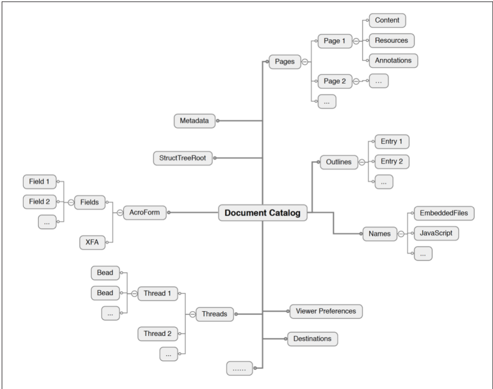

# Sintaxe

As estruturas mais básicas de um pdf são os objetos, existem basicamente os tipos 
- Null
- Boolean
- Numeric
- Name
- String
- Array
- Dictionary
- Stream

Porém, um PDF pode ser dividido lógicamente em elementos maiores, como por exemplo o Catalog ou o elemento Pages, esses elementos são definidos com Objetos do tipo Dictionary e com a chave Type que define o tipo de elemento. Por exemplo o Catalog é um dicionário com Type = Catalog, e possui diversas outras propriedades. No código esses elementos principais são definidos como structs sendo que suas propriedades obrigatórias serão elementos da struct e as propriedades opcionais serão um HashMap de propriedades cujas chaves serão definidas em enums.

# Catalog

O catalogo é o nó central da árvore de conteudos de um PDF, ele possui referências para outros objetos, ele possui os seguintes parâmetros obrigatórios:

| Chave    | Tipo    | 
| -------- | ------- | 
| Type     | name    |
| Pages    | dict    |

